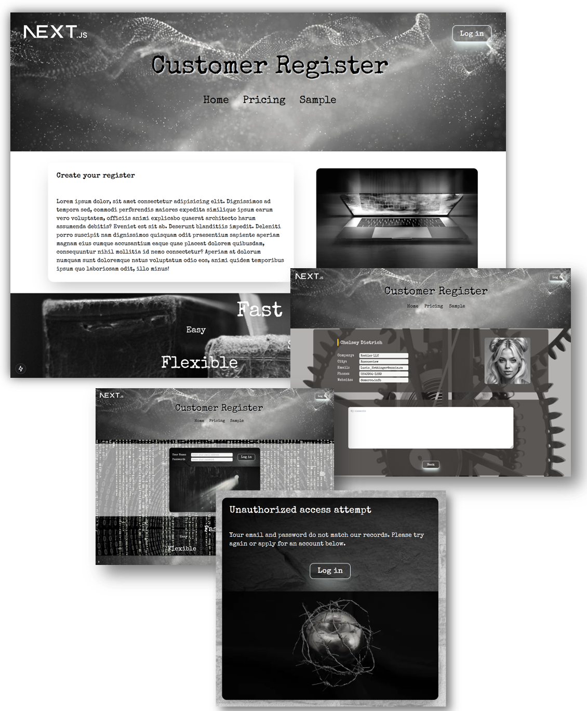

# Customer Register - a Next.js/React/TypeScript/Tailwind Demo

  Next.js Demo by <a href="https://iceeqsolutions.fi/">iCeeqSolutions</a>

## About

The Customer Register is a Next.js/React/TypeScript demo project where we've used a simple API (jsonplaceholder.typicode.com) to access a small 10-item long JSON object. No API key is required for this. However, even with this limited amound of data, it's possible to play around with the data in Next.js and get a feel for how to set up a dynamic routes.

All of this could be taken a step further by adding a database connection and athetication + authorization. In this simple demo, however, no such connection is available. Instead, clicking the buttons will only re-routes the user to the different pages in the project.

For styling, we used Tailwind that allows for higher flexibility than e.g. Bootstrap. You can find some custom configurations in the tailwind.config.ts file, which we set up for this demo.

## Demo

👁️ [Live Demo](https://customer-register.vercel.app/)

## Built with

- Next.js
- TypeScript
- React
- Tailwind
- API data: JSONPlaceholder
- Prettier

## Features

- React components
- Routing
- Tailwind custom config

  

  
